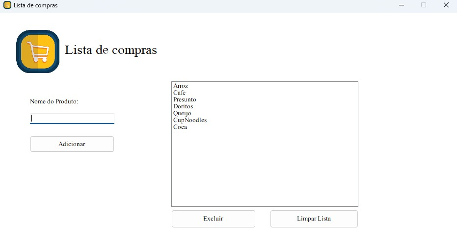

# Gerenciador de Lista de Compras - C#

Este é um programa simples desenvolvido em C# com Windows Forms para gerenciamento de uma lista de compras. O objetivo do programa é permitir ao usuário adicionar itens em uma lista, visualizar esses itens em um ListBox, e possibilitar a exclusão de itens individualmente ou da lista inteira.

---

## Funcionalidades

- **Adicionar itens**: Digite o nome do item no TextBox e adicione-o à lista clicando no botão correspondente.
- **Visualizar lista**: Os itens adicionados aparecem em um ListBox para fácil visualização.
- **Excluir item**: Selecione um item na lista e exclua-o com o botão de exclusão individual.
- **Limpar lista**: Exclua todos os itens da lista com um único clique.
- **Usabilidade**: O programa possui recursos que facilitam a interação do usuário, como validação de entrada e confirmação para exclusão da lista inteira.

---

## Como usar

1. Abra o programa.
2. No campo de texto, digite o item que deseja adicionar.
3. Clique no botão "Adicionar" para inserir o item na lista.
4. Para remover um item, selecione-o no ListBox e clique no botão "Excluir item".
5. Para apagar toda a lista, clique no botão "Limpar lista" e confirme a ação.

---

## Captura de tela

---

## Tecnologias utilizadas

- C#  
- Windows Forms (.NET Framework)

---

## Como contribuir

Contribuições são bem-vindas! Sinta-se à vontade para abrir issues ou enviar pull requests com melhorias e correções.

---

## Licença

Este projeto está licenciado sob a licença MIT. Veja o arquivo LICENSE para mais detalhes.

---

**Desenvolvido por [Seu Nome]**
